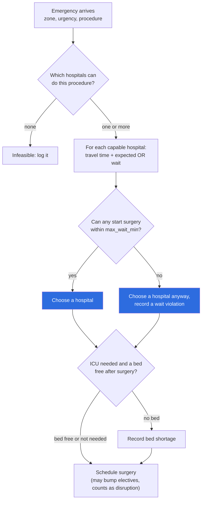

# Emergency allocation: decision flow

The highlighted step is where policies differ (baselines, SA/GA, RL).
Everything else is fixed simulator logic.

```mermaid
flowchart TD
  A["Emergency arrives<br/>zone, urgency, procedure"] --> B{"Which hospitals can<br/>do this procedure?"}
  B -->|none| X["Infeasible: log it"]
  B -->|one or more| C["For each capable hospital:<br/>travel time + expected OR wait"]
  C --> D{"Can any start surgery<br/>within max_wait_min?"}
  D -->|yes| E["Choose a hospital"]
  D -->|no| F["Choose a hospital anyway,<br/>record a wait violation"]
  E --> G{"ICU needed and a bed<br/>free after surgery?"}
  F --> G
  G -->|no bed| H["Record bed shortage"]
  G -->|bed free or not needed| I["Schedule surgery<br/>(may bump electives, counts as disruption)"]
  H --> I
  style E fill:#2d6cdf,color:#fff
  style F fill:#2d6cdf,color:#fff
```