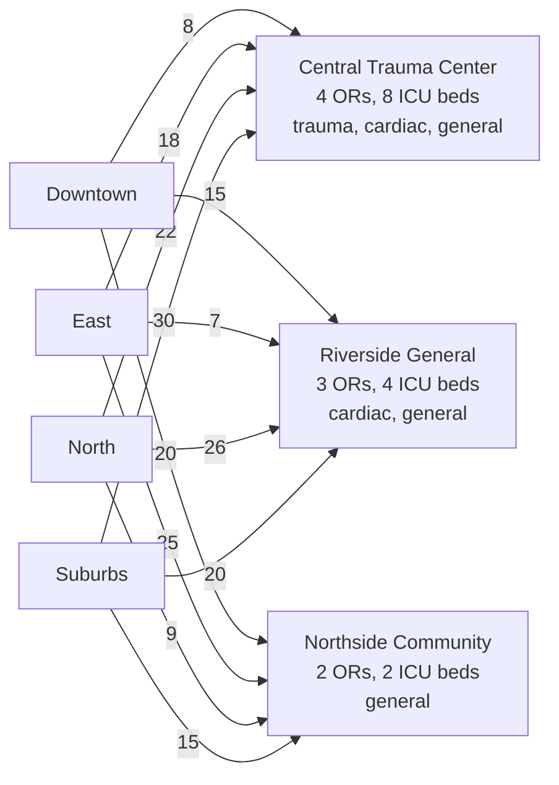

# Base network (configs/base.json)

Edge labels are travel times in minutes.

```mermaid
graph LR
  Z0[Downtown]
  Z1[East]
  Z2[North]
  Z3[Suburbs]
  H0["Central Trauma Center<br/>4 ORs, 8 ICU beds<br/>trauma, cardiac, general"]
  H1["Riverside General<br/>3 ORs, 4 ICU beds<br/>cardiac, general"]
  H2["Northside Community<br/>2 ORs, 2 ICU beds<br/>general"]

  Z0 -- 8 --> H0
  Z0 -- 15 --> H1
  Z0 -- 20 --> H2
  Z1 -- 18 --> H0
  Z1 -- 7 --> H1
  Z1 -- 25 --> H2
  Z2 -- 22 --> H0
  Z2 -- 26 --> H1
  Z2 -- 9 --> H2
  Z3 -- 30 --> H0
  Z3 -- 20 --> H1
  Z3 -- 15 --> H2
```