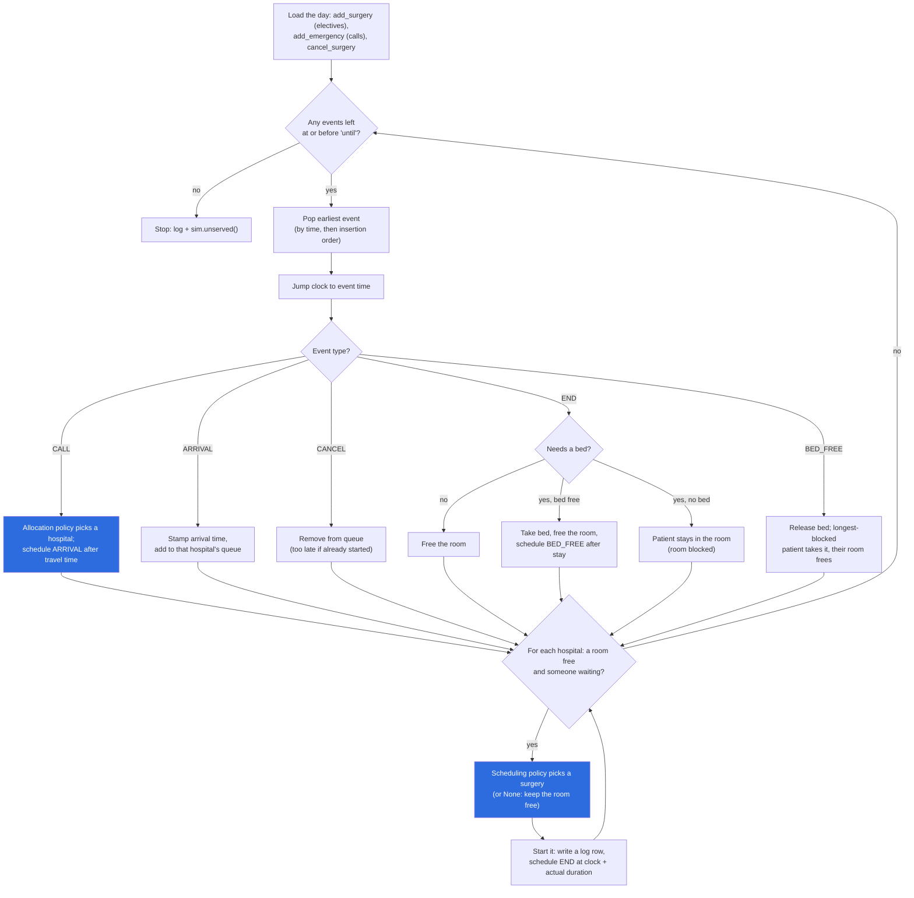

# Simulator event loop (src/surgiflow/sim/core.py)

Blue boxes are the plug-in policies (D9). Everything else is fixed simulator logic.

```mermaid
flowchart TD
  A["Load the day: add_surgery (electives),<br/>add_emergency (calls), cancel_surgery"] --> B{"Any events left<br/>at or before 'until'?"}
  B -->|no| Z["Stop: log + sim.unserved()"]
  B -->|yes| C["Pop earliest event<br/>(by time, then insertion order)"]
  C --> D["Jump clock to event time"]
  D --> E{"Event type?"}
  E -->|CALL| F["Allocation policy picks a hospital;<br/>schedule ARRIVAL after travel time"]
  E -->|ARRIVAL| G["Stamp arrival time,<br/>add to that hospital's queue"]
  E -->|CANCEL| H["Remove from queue<br/>(too late if already started)"]
  E -->|END| I{"Needs a bed?"}
  I -->|no| J["Free the room"]
  I -->|"yes, bed free"| K["Take bed, free the room,<br/>schedule BED_FREE after stay"]
  I -->|"yes, no bed"| L["Patient stays in the room<br/>(room blocked)"]
  E -->|BED_FREE| M["Release bed; longest-blocked<br/>patient takes it, their room frees"]
  F --> N
  G --> N
  H --> N
  J --> N
  K --> N
  L --> N
  M --> N
  N{"For each hospital: a room free<br/>and someone waiting?"}
  N -->|no| B
  N -->|yes| P["Scheduling policy picks a surgery<br/>(or None: keep the room free)"]
  P --> Q["Start it: write a log row,<br/>schedule END at clock + actual duration"]
  Q --> N
  style F fill:#2d6cdf,color:#fff
  style P fill:#2d6cdf,color:#fff
```
